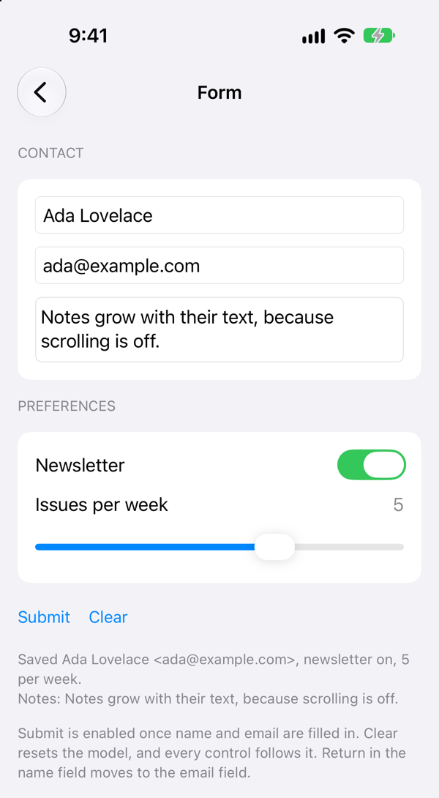
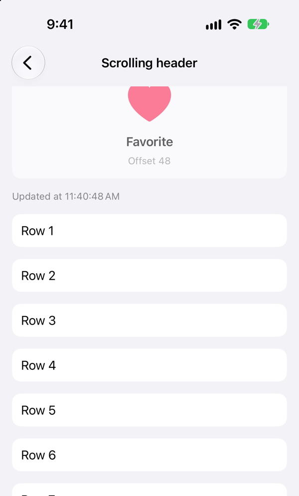
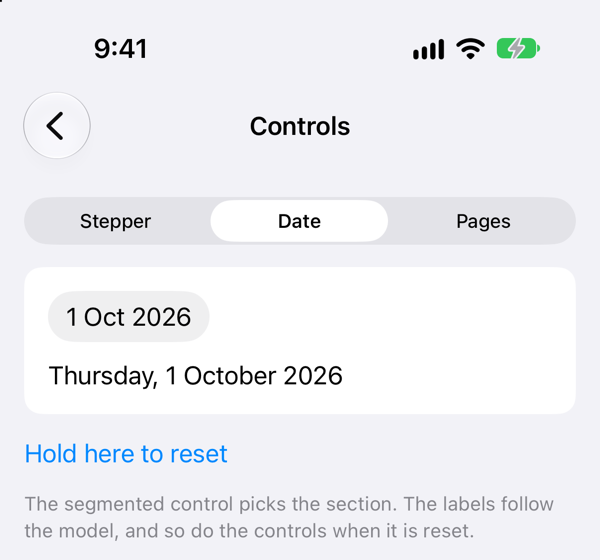

# DeclarativeCombine

[English](README.md) | [简体中文](README.zh-Hans.md) | **繁體中文**

為 UIKit 視圖提供 Combine 繫結，搭配 [DeclarativeUIKit](https://github.com/nothingsh/DeclarativeUIKit) 的內容閉包使用。

需要更新或回報事件的視圖，不必再存成版面配置之外的屬性。在宣告它的地方直接繫結：

```swift
view.addVStack(alignment: .fill, spacing: 12, safeArea: .all) {
    UITextField()
        .placeholder("Name")
        .sink(\.textPublisher) { [weak self] in self?.model.name = $0 }

    UILabel()
        .font(textStyle: .footnote)
        .bind(\.text, to: $model.map(\.hint))

    UIButton(type: .system)
        .title("Submit")
        .bind(\.isEnabled, to: $model.map(\.canSubmit))
        .sink(\.tapPublisher) { [weak self] in self?.submit() }
}
```

每個 modifier 都回傳視圖本身，訂閱的生命週期與視圖完全一致。不需要繼承基底類別，也不需要遵循協定：任何 `UIView` 子類別，包括你自己的，都可以繫結。

## 目錄

- [環境需求](#環境需求)
- [安裝](#安裝)
- [用法](#用法)
  - [資料到視圖](#資料到視圖)
  - [視圖的事件](#視圖的事件)
  - [Publisher](#publisher)
- [規則](#規則)
- [範例 App](#範例-app)
  - [Form](#form)
  - [Scrolling header](#scrolling-header)
  - [Controls](#controls)
- [已知限制](#已知限制)
- [授權](#授權)

## 環境需求

- iOS 13+
- Swift 5.9+

## 安裝

使用 Swift Package Manager。在 `Package.swift` 中：

```swift
dependencies: [
    .package(url: "https://github.com/nothingsh/DeclarativeCombine.git", from: "0.1.0")
]
```

或在 Xcode 中選擇 File → Add Package Dependencies，輸入 `https://github.com/nothingsh/DeclarativeCombine`。

本套件不依賴 DeclarativeUIKit。兩個套件一起加入即可搭配使用，也可以單獨用在任何 UIKit 程式碼裡。

## 用法

### 資料到視圖

`bind(_:to:)` 把 publisher 發出的每個值指派給視圖的一個屬性：

```swift
UILabel().bind(\.text, to: viewModel.$title)
UIButton().bind(\.isEnabled, to: viewModel.$canSubmit)
AvatarView().bind(\.user, to: viewModel.$user)   // 你自己的視圖和屬性
```

用 Combine 的運算子從較大的模型裡取出一個欄位：

```swift
UILabel().bind(\.text, to: $model.map(\.title).removeDuplicates())
```

`onReceive(_:perform:)` 用於不是單一屬性的情況。閉包會收到視圖和值：

```swift
UIButton(type: .system)
    .onReceive(viewModel.$title) { button, title in
        button.setTitle(title, for: .normal)
    }

UITextField()
    .onReceive(viewModel.focusName) { field, _ in
        field.becomeFirstResponder()
    }
```

要顯示或隱藏視圖，繫結 `isHidden`。stack view 會收合隱藏的子視圖：

```swift
UILabel().bind(\.isHidden, to: $model.map(\.error.isEmpty))
```

### 視圖的事件

`sink(_:receiveValue:)` 訂閱視圖自己的某個 publisher：

```swift
UIButton(type: .system)
    .sink(\.tapPublisher) { [weak self] in self?.submit() }

UITextField()
    .sink({ $0.publisher(for: .editingDidEnd) }) { [weak self] in self?.validate() }
```

`send(_:to:)` 把值轉送給一個 subject。completion 不會被轉送：

```swift
let taps = PassthroughSubject<Void, Never>()

UIButton(type: .system).send(\.tapPublisher, to: taps)
```

在同一個 subject 上同時 bind 和 send，就是雙向繫結：

```swift
let name = CurrentValueSubject<String, Never>("")

UITextField()
    .bind(\.text, to: name)
    .send(\.textPublisher, to: name)
```

### Publisher

| 視圖 | Publisher | 發出 |
|---|---|---|
| `UIControl` | `publisher(for:)` | `Void`，每次其中一個事件觸發時 |
| `UIButton` | `tapPublisher` | `Void`，`.touchUpInside` 時 |
| `UITextField` | `textPublisher` | `String`，`.editingChanged` 時 |
| `UITextField` | `returnPublisher` | `Void`，按下 return 鍵時 |
| `UITextView` | `textPublisher` | `String`，使用者編輯文字時 |
| `UISwitch` | `isOnPublisher` | `Bool`，`.valueChanged` 時 |
| `UISlider` | `valuePublisher` | `Float`，`.valueChanged` 時 |
| `UIStepper` | `valuePublisher` | `Double`，`.valueChanged` 時 |
| `UISegmentedControl` | `selectedSegmentIndexPublisher` | `Int`，`.valueChanged` 時 |
| `UIDatePicker` | `datePublisher` | `Date`，`.valueChanged` 時 |
| `UIPageControl` | `currentPagePublisher` | `Int`，`.valueChanged` 時 |
| `UIRefreshControl` | `refreshPublisher` | `Void`，使用者下拉重新整理時 |
| `UIScrollView` | `contentOffsetPublisher` | `CGPoint`，每次位移量變化時 |
| `UIScrollView` | `contentSizePublisher` | `CGSize`，每次內容尺寸變化時 |
| `UIView` | `tapGesturePublisher` | `UITapGestureRecognizer`，每次點按時 |
| `UIView` | `longPressGesturePublisher` | `UILongPressGestureRecognizer`，每次狀態變化時 |
| `UIView` | `gesturePublisher(_:)` | 你傳入的辨識器，每次它送出 action 時 |

它們可以脫離繫結 modifier 單獨使用：

```swift
button.tapPublisher
    .sink { print("tapped") }
    .store(in: &cancellables)
```

控制項的 publisher 只在使用者互動時發出：訂閱時不發出，用程式碼指派時也不發出。scroll view 的 publisher 在每次變化時發出，包括程式碼造成的變化，訂閱時同樣不發出。所有 publisher 都不會讓視圖無法釋放，也都不會結束。

`returnPublisher` 使用 `.editingDidEndOnExit`，這個事件有 target 時 UIKit 會收起鍵盤。

搜尋列的文字欄位是 `UITextField`，所以 `searchBar.searchTextField.textPublisher` 可以直接用。

#### 手勢

訂閱手勢 publisher 會替視圖加入一個辨識器，取消訂閱時移除：

```swift
UIImageView(image: photo)
    .isUserInteractionEnabled(true)
    .sink(\.tapGesturePublisher) { [weak self] _ in self?.showPhoto() }

UIView()
    .sink({ $0.gesturePublisher(UIPanGestureRecognizer()) }) { [weak self] pan in
        self?.drag(by: pan.translation(in: pan.view))
    }
```

`UILabel` 和 `UIImageView` 在 `isUserInteractionEnabled` 為 `true` 之前不回應觸控。連續手勢在每次狀態變化時都發出，用 `state` 區分。

## 規則

- **弱參考 `self`。** 視圖在存活期間一直持有你的閉包，也包括你繫結的 publisher 裡的閉包，例如 `map { self.format($0) }`。閉包強參考視圖控制器會造成循環參考。
- **publisher 不能失敗。** 只接受 `Failure == Never`。繫結前先處理錯誤，例如用 `replaceError(with:)`。
- **在主執行緒發出。** 值在 publisher 發出的地方同步套用，函式庫不會替你切到主執行緒。在背景發出的 publisher 要加 `receive(on: DispatchQueue.main)`。
- **每個值都會被指派。** 加 `removeDuplicates()` 可以略過沒有變化的值。
- **使用傳給閉包的值。** `@Published` 在屬性改變之前發出，在 `onReceive` 裡讀這個屬性得到的是舊值。
- **同一個屬性繫結兩次，兩個訂閱都會保留。** 以最新的值為準。

## 範例 App

`Example/Example.xcodeproj` 是一個小型 iOS App，以本機套件的方式使用本套件，並從 GitHub 引入 DeclarativeUIKit。用 Xcode 開啟，選擇 `Example` scheme 和一個 iOS 模擬器即可執行。下面的程式碼片段摘自它的三個畫面。

### Form

這就是 DeclarativeUIKit 範例 App 裡的那個表單。在那邊，視圖控制器把八個視圖存成屬性，加入了四個 target，還需要三個 `@objc` 方法和一個文字欄位委派。在這裡這些都不需要，因為每個控制項都在宣告它的地方繫結。view model 是純 Combine，對視圖一無所知。在 name 文字欄位裡按 return，會透過 `nameReturned` 這個 subject 傳到 email 文字欄位，兩個文字欄位互不參考。

<table>
<tr>
<td>

```swift
UITextField()
    .placeholder("Name")
    .returnKeyType(.next)
    .bind(\.text, to: model.name)
    .send(\.textPublisher, to: model.name)
    .send(\.returnPublisher, to: nameReturned)

UITextField()
    .placeholder("Email")
    .bind(\.text, to: model.email)
    .send(\.textPublisher, to: model.email)
    .onReceive(nameReturned) { field, _ in
        field.becomeFirstResponder()
    }

UISlider()
    .minimumValue(1)
    .maximumValue(7)
    .bind(\.value, to: model.issuesPerWeek)
    .sink(\.valuePublisher) {
        model.issuesPerWeek.send($0.rounded())
    }

UIButton(type: .system)
    .title("Submit")
    .bind(\.isEnabled, to: model.canSubmit)
    .send(\.tapPublisher, to: model.submit)

UILabel()
    .numberOfLines(0)
    .bind(\.text, to: model.result)
```

</td>
<td width="300">

</td>
</tr>
</table>

### Scrolling header

scroll view 把位移量送給 `offset`，這是視圖控制器持有的一個 subject，標頭再從它讀回來：頁面上滑時標頭淡出。標頭和 scroll view 互不參考。愛心是一個帶點按手勢的 image view，下拉重新整理在 model 發布新時間時結束。

<table>
<tr>
<td>

```swift
addScreen {
    VStack(spacing: 8) {
        UIImageView()
            .isUserInteractionEnabled(true)
            .bind(\.image, to: model.$isFavorite.map {
                UIImage(systemName: $0 ? "heart.fill" : "heart")
            })
            .sink(\.tapGesturePublisher) { _ in
                model.toggleFavorite()
            }
        UILabel()
            .bind(\.text, to: offset.map { "Offset \(Int($0))" })
    }
    .card()
    .bind(\.alpha, to: offset.map {
        1 - min(max($0 / 120, 0), 1)
    })

    // ...
}
.send({ $0.contentOffsetPublisher.map(\.y) }, to: offset)
.configure {
    $0.refreshControl = UIRefreshControl()
        .sink(\.refreshPublisher) { model.reload() }
        .onReceive(model.$updatedAt.dropFirst()) { control, _ in
            control.endRefreshing()
        }
}
```

</td>
<td width="300">

</td>
</tr>
</table>

### Controls

分段控制項把選取的區塊寫入 model，每個區塊把 `isHidden` 繫結到它。stack view 會收合隱藏區塊留下的空隙，所以沒有視圖被加入或移除。長按在每次狀態變化時都發出，所以重設時只取長按開始的那一次。

<table>
<tr>
<td>

```swift
UISegmentedControl(items: ControlsViewModel.sections)
    .bind(\.selectedSegmentIndex, to: model.$section)
    .sink(\.selectedSegmentIndexPublisher) {
        model.section = $0
    }

VStack(alignment: .leading, spacing: 12) {
    UIDatePicker()
        .bind(\.date, to: model.$date)
        .sink(\.datePublisher) { model.date = $0 }
    UILabel()
        .bind(\.text, to: model.$date.map {
            Self.dateFormatter.string(from: $0)
        })
}
.card()
.bind(\.isHidden, to: model.$section.map { $0 != 1 })

UILabel()
    .text("Hold here to reset")
    .isUserInteractionEnabled(true)
    .sink({
        $0.longPressGesturePublisher.filter { $0.state == .began }
    }) { _ in model.reset() }
```

</td>
<td width="300">

</td>
</tr>
</table>

## 已知限制

- 內容閉包仍然只執行一次。繫結更新的是屬性，不會新增、移除或重排視圖。
- 繫結在視圖釋放之前無法移除，所以不要在每次設定可重用 cell 時重新繫結。
- 沒有委派回呼的 publisher，例如選取表格的一列。請自己設定委派。

## 授權

MIT。見 [LICENSE](LICENSE)。
